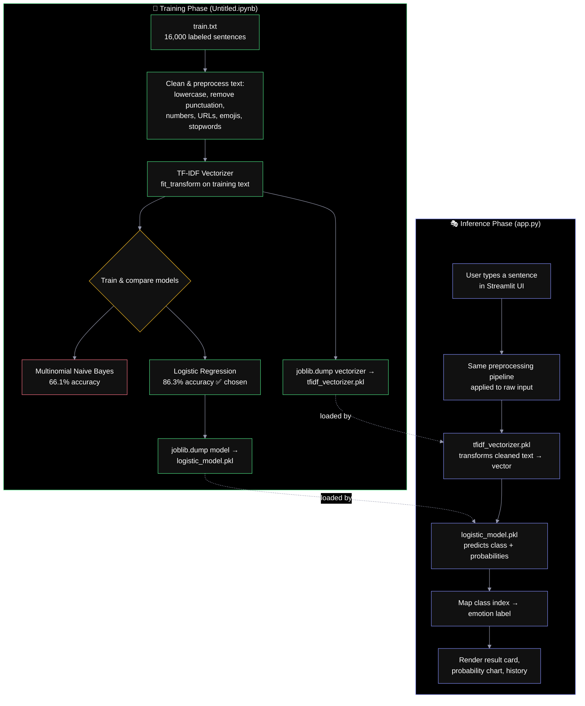

# 🎭 Emotion Predictor

A text-based emotion classifier that reads a sentence and predicts the emotion behind it — **sadness, anger, love, surprise, fear,** or **joy** — using a **TF-IDF + Logistic Regression** model, served through an interactive **Streamlit** app.

🔗 **Repository:** [github.com/fadifadifadifadi157-glitch/Emotion-Predictor-Text-Based-Emotion-Classifier](https://github.com/fadifadifadifadi157-glitch/Emotion-Predictor-Text-Based-Emotion-Classifier)

---

## Table of Contents

- [Overview](#overview)
- [Features](#features)
- [Project Structure](#project-structure)
- [Architecture](#architecture)
- [Dataset](#dataset)
- [Preprocessing Pipeline](#preprocessing-pipeline)
- [Model Training & Selection](#model-training--selection)
- [Label Mapping](#label-mapping)
- [Prerequisites](#prerequisites)
- [Setup & Installation](#setup--installation)
- [Running the App](#running-the-app)
- [Usage Guide](#usage-guide)
- [App Walkthrough](#app-walkthrough)
- [Project Flow](#project-flow)
- [Troubleshooting](#troubleshooting)
- [Notes & Limitations](#notes--limitations)

---

## Overview

This project classifies the emotional tone of a sentence into one of six categories. It has two parts:

1. **Training notebook** (`Untitled.ipynb`, using `train.txt`) — cleans a labeled dataset of ~16,000 sentences, converts text into TF-IDF features, trains and compares two models (Naive Bayes vs. Logistic Regression), and saves the best-performing model and vectorizer to disk.
2. **Streamlit app** (`app.py`) — loads those saved artifacts (`logistic_model.pkl`, `tfidf_vectorizer.pkl`) and serves live predictions through a styled, interactive web UI — no retraining, no logic changes from the notebook.

The app applies the **exact same preprocessing steps** used during training, so what the model sees at inference time matches what it was trained on.

---

## Features

| Feature | Description |
|---|---|
| ✨ Live prediction | Type any sentence and get an instant emotion prediction |
| 📊 Probability breakdown | Optional horizontal bar chart showing confidence across all 6 classes (Plotly) |
| 🔍 Cleaned-text preview | Optionally see exactly what text (after preprocessing) was fed to the model |
| 📝 Example sentences | A dropdown of ready-made example inputs to try instantly |
| 🕘 Prediction history | Keeps the last 10 predictions visible in the session |
| 🎨 Custom themed UI | Gradient hero header, color-coded result cards per emotion, styled buttons |
| ⚡ Cached model loading | Model, vectorizer, and NLTK stopwords are loaded once and cached via `@st.cache_resource` |

---

## Project Structure

```
emotion-predictor/
├── app.py                   # Streamlit app — loads model & serves predictions
├── Untitled.ipynb           # Training notebook (EDA, preprocessing, model training)
├── train.txt                # Raw labeled dataset (text ; emotion)
├── logistic_model.pkl       # Trained Logistic Regression model (saved from notebook)
├── tfidf_vectorizer.pkl     # Fitted TF-IDF vectorizer (saved from notebook)
├── requirements.txt         # Python dependencies
└── README.md                # This file
```

> `logistic_model.pkl` and `tfidf_vectorizer.pkl` must sit in the same folder as `app.py` — the app loads them by relative path (`joblib.load("logistic_model.pkl")`, etc.).

---

## Architecture



**Key design principle:** the preprocessing functions in `app.py` (`remove_pun`, `remove_num`, `remove_url`, `remove_emoji`, `remove_stopwords`) are a direct, line-for-line port of the same functions used in the training notebook. This guarantees **train/inference consistency** — the model never sees text cleaned differently than what it learned from.

---

## Dataset

- **File:** `train.txt`
- **Format:** semicolon-separated, two columns, no header — `text;emotion`
- **Size:** 16,000 rows
- **Labels:** 6 emotion classes, read directly from the data via `df['emotion'].unique()`
- **No missing values** (`df.isnull().sum()` confirmed 0 nulls in both columns)

Example rows:
| text | emotion |
|---|---|
| i didnt feel humiliated | sadness |
| im grabbing a minute to post i feel greedy wrong | anger |
| i am ever feeling nostalgic about the fireplace | love |

---

## Preprocessing Pipeline

Applied identically in both the training notebook and `app.py`, in this exact order:

1. **Lowercase** — normalize casing
2. **Remove punctuation** — strip all `string.punctuation` characters
3. **Remove numbers** — strip digit characters
4. **Remove URLs** — regex strips `http(s)://...` and `www...` patterns
5. **Remove emojis / non-ASCII characters** — keeps only ASCII characters
6. **Remove stopwords** — filters out common English stopwords (via `nltk.corpus.stopwords`, 198 words)

```python
def preprocess(text: str) -> str:
    text = text.lower()
    text = remove_pun(text)
    text = remove_num(text)
    text = remove_url(text)
    text = remove_emoji(text)
    text = remove_stopwords(text)
    return text
```

**Example transformation:**
- Before: `"i can go from feeling so hopeless to so damned hopeful just from being around someone who cares and is awake"`
- After: `"go feeling hopeless damned hopeful around someone cares awake"`

---

## Model Training & Selection

Two approaches were trained and compared on an 80/20 train-test split (`random_state=42`):

| Model | Features | Test Accuracy |
|---|---|---|
| Multinomial Naive Bayes | TF-IDF | 66.1% |
| Multinomial Naive Bayes | Count Vectorizer | 66.1% |
| **Logistic Regression** | **TF-IDF** | **86.3% ✅ (selected)** |

Logistic Regression with TF-IDF features was chosen as the final model for its significantly higher accuracy, and both the fitted model and vectorizer were serialized with `joblib` for reuse in the app:

```python
joblib.dump(model_lr, 'logistic_model.pkl')
joblib.dump(vector_t, 'tfidf_vectorizer.pkl')
```

---

## Label Mapping

Class indices are assigned in the order emotions first appear in the dataset (`df['emotion'].unique()`), and this exact mapping is hardcoded in `app.py` to match:

| Model output (index) | Emotion | Emoji |
|---|---|---|
| 0 | sadness | 😢 |
| 1 | anger | 😠 |
| 2 | love | ❤️ |
| 3 | surprise | 😮 |
| 4 | fear | 😨 |
| 5 | joy | 😄 |

---

## Prerequisites

- Python 3.9+
- No API keys required — this app runs entirely offline/local once dependencies and NLTK data are installed.

---

## Setup & Installation

1. **Get the project files** into a folder: `app.py`, `logistic_model.pkl`, `tfidf_vectorizer.pkl`, `requirements.txt` (and optionally `Untitled.ipynb` + `train.txt` if you want to retrain).

2. **Create and activate a virtual environment:**
   ```bash
   python -m venv venv
   source venv/bin/activate      # Windows: venv\Scripts\activate
   ```

3. **Install dependencies:**
   ```bash
   pip install -r requirements.txt
   ```

> NLTK stopwords are downloaded automatically on first run if not already present (`app.py` checks and downloads them via `nltk.download("stopwords")` inside a cached function) — no manual step needed.

---

## Running the App

```bash
streamlit run app.py
```

Streamlit prints a local URL (typically `http://localhost:8501`) — open it in your browser.

---

## Usage Guide

1. **Pick an example** from the dropdown, or type your own sentence in the text box.
2. Click **✨ Predict Emotion**.
3. View the result:
   - A color-coded card showing the predicted emotion, its emoji, and confidence %.
   - (Optional, sidebar toggle) The **cleaned text** actually sent to the model.
   - (Optional, sidebar toggle) A **probability breakdown** bar chart across all 6 emotions.
4. Your last 10 predictions appear under **🕘 Recent predictions**.
5. Use **🗑️ Clear history** in the sidebar to reset the prediction history.

---

## App Walkthrough

| Section | What it shows |
|---|---|
| **Sidebar — About** | Model type, feature type, and the 6 emotion classes with emojis |
| **Sidebar — Toggles** | Show/hide probability breakdown and cleaned-text preview |
| **Sidebar — Clear history** | Wipes the running prediction history |
| **Hero header** | Gradient title and short description |
| **Example selector** | Dropdown of 4 ready-made example sentences |
| **Text input** | Free-text box for custom input |
| **Result card** | Emotion-specific colored card with emoji, label, and confidence |
| **Probability chart** | Horizontal bar chart (Plotly) ranking all 6 class probabilities |
| **History list** | Last 10 predictions with emoji, label, confidence, and input text |

---

## Project Flow

1. **App starts** → NLTK stopwords are loaded/downloaded and cached; `logistic_model.pkl` and `tfidf_vectorizer.pkl` are loaded and cached (`@st.cache_resource`), so this happens only once per app process.
2. **User selects an example or types a sentence**, then clicks **Predict Emotion**.
3. **Input validation** → if the text box is empty, a warning is shown and nothing is processed.
4. **Preprocessing** → the raw input runs through the identical cleaning pipeline used during training.
5. **Vectorization** → the cleaned text is transformed into a TF-IDF vector using the saved, already-fitted vectorizer (`transform`, not `fit_transform` — it reuses the training vocabulary).
6. **Prediction** → the Logistic Regression model predicts the most likely class and the full probability distribution across all 6 classes.
7. **Label mapping** → the predicted numeric class is mapped back to its emotion name via `EMOTION_MAP`.
8. **Rendering** → a styled result card, optional cleaned-text box, and optional probability chart are displayed.
9. **History update** → the prediction is prepended to the session's history list, capped at the most recent 10 entries.
10. **Repeat** → the user can predict again; **Clear history** resets the list at any time.

---

## Troubleshooting

| Issue | Likely Cause | Fix |
|---|---|---|
| `FileNotFoundError: logistic_model.pkl` | Model/vectorizer files aren't in the same folder as `app.py` | Make sure `logistic_model.pkl` and `tfidf_vectorizer.pkl` sit alongside `app.py` |
| NLTK download errors / no internet | `nltk.download("stopwords")` needs network access on first run | Run once with internet access so stopwords get cached locally; afterward it works offline |
| App won't start / import errors | Missing dependency | Re-run `pip install -r requirements.txt` inside your virtual environment |
| Prediction always same/odd class | Input text became empty after cleaning (e.g., only numbers/punctuation) | Check the "Show cleaned text" toggle to see what the model actually received |
| Probabilities don't sum to label shown | Normal — `predict_proba` gives probabilities for all classes; the card shows only the top one | Enable the probability breakdown to see the full distribution |

---

## Notes & Limitations

- The model is trained on short, informal English sentences — performance may degrade on long paragraphs, non-English text, or highly sarcastic/ambiguous phrasing.
- Preprocessing removes all non-ASCII characters, so emoji-based sentiment cues are discarded before the model ever sees them.
- The app performs **inference only** — no retraining happens at runtime. To update the model, retrain in `Untitled.ipynb` using `train.txt`, re-save both `.pkl` files, and restart the app.
- Prediction history is stored only in the current browser session (`st.session_state`) and is lost on page refresh or app restart.
